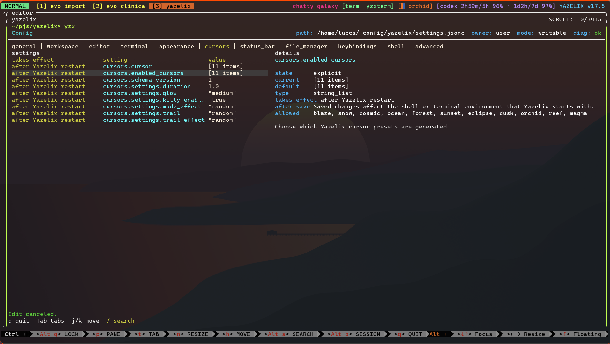

# Ratconfig

Ratconfig is a reusable Rust crate for building Ratatui config editors over JSONC- and TOML-backed settings

It is extracted from Yazelix, but it is project-agnostic: applications provide their own config schema, default values, validation, file writes, and post-save apply behavior



Example host integration in Yazelix: ratconfig owns the reusable tabs, rows, edit state, details pane, diagnostics, and rendering while the host supplies product-specific settings metadata and save/apply policy

## What It Owns

- generic config document and field model
- tabs, visible rows, search, selection, notices, and edit state
- optional host-supplied list table profiles for structured field tabs
- staged bool toggles, scalar editing, single-select, multiselect, and default reset controls
- host-routed file action rows for native config files
- built-in dark/light UI palettes and optional model-driven theme switching
- generic Ratatui rendering for the model
- optional host-supplied rich detail rendering callbacks
- comment-preserving JSONC and TOML set/unset patch primitives
- deterministic migration operations: rename, delete, add default, and narrow value transform
- deterministic config contracts that record joined state, replay safe versioned changes, and report manual blockers when automation is not safe

## What The Host Owns

- loading defaults and user config
- deciding which fields exist and how they are grouped
- validation and diagnostics
- file IO and atomic writes
- native config file creation and editor launching for file action rows
- mapping ratconfig errors into application-specific errors
- applying saved settings to a live runtime
- any product-specific detail text, commands, keybindings, or ownership policy
- deciding where contract state is stored and when migrated text is written atomically

Yazelix-specific behavior stays out of this repository, including Home Manager ownership, Zellij/Yazi policy, generated runtime refreshes, and Yazelix command names

## Minimal Shape

```rust
use std::path::PathBuf;
use ratconfig::{
    ConfigUiApplyStatus, ConfigUiEditBehavior, ConfigUiField, ConfigUiModel,
    ConfigUiPathOwner, ConfigUiValueState,
    DEFAULT_CONFIG_SOURCE_ID,
    jsonc::{PatchError, set_jsonc_value_text},
};

fn model() -> ConfigUiModel {
    ConfigUiModel {
        active_config_path: PathBuf::from("settings.jsonc"),
        cursor_config_path: PathBuf::new(),
        default_cursor_config_path: PathBuf::new(),
        active_config_exists: true,
        config_owner: ConfigUiPathOwner::User,
        config_read_only: false,
        sources: Vec::new(),
        tabs: vec!["general".to_string()],
        tab_list_tables: std::collections::BTreeMap::new(),
        fields: vec![ConfigUiField {
            source_id: DEFAULT_CONFIG_SOURCE_ID.to_string(),
            path: "core.debug".to_string(),
            display_label: String::new(),
            list_cells: Vec::new(),
            tab: "general".to_string(),
            kind: "bool".to_string(),
            current_value: "false".to_string(),
            edit_value: "false".to_string(),
            default_value: "false".to_string(),
            state: ConfigUiValueState::Explicit,
            description: "Enable debug logging".to_string(),
            allowed_values: Vec::new(),
            validation: "bool".to_string(),
            rebuild_required: false,
            apply_status: ConfigUiApplyStatus {
                summary: "after restart".to_string(),
                label: "restart".to_string(),
                detail: "Reload the application to apply this value".to_string(),
                pending: false,
            },
            edit_behavior: ConfigUiEditBehavior::Default,
        }],
        file_actions: Vec::new(),
        sidecars: Vec::new(),
        native_config_statuses: Vec::new(),
        diagnostics: Vec::new(),
        theme_switcher: None,
    }
}

fn patch_jsonc() -> Result<String, PatchError> {
    let outcome = set_jsonc_value_text(
        r#"{ "core": { "debug": false } }"#,
        "core.debug",
        &serde_json::json!(true),
    )?;
    Ok(outcome.text)
}
```

Host applications build the model from their own schema and config files, then use ratconfig editor/rendering helpers inside their terminal event loop. After an edit, the host validates and writes the patched text, reloads the model, and applies any live runtime changes it owns

Populate `ConfigUiModel::sources` when tabs represent separate host-owned config documents. Ratconfig uses that metadata only to render the selected tab's label, path, owner, and write mode; hosts still own discovery, loading, writes, creation policy, and validation

Use `ConfigUiField::display_label` when row and detail text should be friendlier than the stable field path. Ratconfig still uses `path` for edit intents and host write routing

Populate `ConfigUiModel::tab_list_tables` and matching `ConfigUiField::list_cells` when a tab should render a structured display table instead of the default `takes effect | setting | value` field list. This is presentation-only data; Ratconfig does not parse labels, values, paths, or host-specific concepts to build those cells

Fields with defaults expose a reset-to-default action that emits `ConfigUiIntent::UnsetField`. Hosts decide whether that means unsetting text, writing a default, validation, persistence, reloads, and apply behavior. Use `NO_CONFIG_DEFAULT_VALUE_LABEL` for manually constructed fields that have no default; builder helpers set it automatically

Populate `ConfigUiModel::theme_switcher` when a committed field value should select a built-in Ratconfig theme. The switcher names one source id, one field path, and `serde_json::Value` mappings to `ConfigUiTheme::Dark` or `ConfigUiTheme::Light`; Ratconfig resolves the initial theme from model fields and switches after `ConfigUiApp::finish_successful_set_field()` or `ConfigUiApp::finish_successful_unset_field()` confirms a successful write of that field. Failed host validation/writeback should not call those methods, so staged edits stay active and the theme does not change

## String-List Choices

Use `build_string_list_choice_field` for string-list settings whose values must come from a host-defined allowed set. `ConfigUiEditBehavior::Default` keeps edited values in allowed-value order; `ConfigUiEditBehavior::OrderedStringList` preserves selected-value order and enables reorder controls in the picker

```rust
use ratconfig::{
    ConfigUiApplyStatus, ConfigUiEditBehavior, ConfigUiField, ConfigUiStringListChoiceSpec,
    build_string_list_choice_field,
    toml_adapter::{TomlPatchError, set_toml_value_text},
};
use serde_json::Value;

fn sections_field() -> Result<ConfigUiField, String> {
    build_string_list_choice_field(ConfigUiStringListChoiceSpec {
        source_id: "settings".to_string(),
        path: "layout.sections".to_string(),
        display_label: "Layout sections".to_string(),
        list_cells: Vec::new(),
        tab: "layout".to_string(),
        current: Some(vec!["left".to_string(), "center".to_string()]),
        default: Some(vec!["center".to_string()]),
        description: "Choose visible layout sections".to_string(),
        allowed_values: vec![
            "left".to_string(),
            "center".to_string(),
            "right".to_string(),
        ],
        validation: "known layout section ids only".to_string(),
        rebuild_required: false,
        apply_status: ConfigUiApplyStatus {
            summary: "after save".to_string(),
            label: "after save".to_string(),
            detail: "Reload the application to apply this value".to_string(),
            pending: true,
        },
        has_blocking_diagnostic: false,
        edit_behavior: ConfigUiEditBehavior::OrderedStringList,
    })
}

fn patch_sections_toml(raw: &str, value: &Value) -> Result<String, TomlPatchError> {
    let outcome = set_toml_value_text(raw, "layout.sections", value)?;
    Ok(outcome.text)
}
```

`ConfigUiIntent::SetField` supplies the edited `serde_json::Value`; the host validates that value against its own schema, calls the TOML patcher or its own writer, writes atomically, reloads the model, and applies any runtime policy it owns

## Arbitrary TOML Documents

Use `build_toml_document_fields` when a host-owned TOML file should be inspectable without declaring every field in a schema. The helper parses the current TOML text, optionally parses default TOML text, and returns ordinary `ConfigUiField` rows plus a `ConfigUiListTable` profile for the tab

```rust
use ratconfig::{
    ConfigUiApplyStatus, ConfigUiModel, ConfigUiTomlDocumentSpec,
    build_toml_document_fields,
    toml_adapter::{TomlPatchError, set_toml_value_text},
};
use serde_json::Value;

fn add_native_toml_rows(model: &mut ConfigUiModel, raw: &str, default_raw: &str) -> Result<(), String> {
    let document = build_toml_document_fields(ConfigUiTomlDocumentSpec {
        source_id: "helix-config",
        tab: "helix",
        current_toml: raw,
        default_toml: Some(default_raw),
        validation: "host validates before writing",
        rebuild_required: false,
        apply_status: ConfigUiApplyStatus {
            summary: "after save".to_string(),
            label: "after save".to_string(),
            detail: "Reload the application to apply this file".to_string(),
            pending: true,
        },
    })?;
    model.tab_list_tables.insert("helix".to_string(), document.list_table);
    model.fields.extend(document.fields);
    Ok(())
}

fn patch_native_toml(raw: &str, path: &str, value: &Value) -> Result<String, TomlPatchError> {
    let outcome = set_toml_value_text(raw, path, value)?;
    Ok(outcome.text)
}
```

The generated rows include tables, scalar leaves, arrays, current/default state, and deterministic table/key ordering. Strings, booleans, integers, floats, and simple string arrays use the normal editable field path when the TOML key path can be represented as dotted bare keys such as `editor.line-number` and the current document can be patched safely through that path

Complex tables, complex arrays, datetimes, quoted keys with dots, and other paths that cannot be safely represented as dotted patch paths are rendered as structured read-only rows. Hosts can pair these rows with a normal file action when users need full TOML editing

Ratconfig still does not infer product labels, schema validation, file layering, atomic writes, reloads, or apply policy for arbitrary TOML documents

Populate `ConfigUiModel::file_actions` when the UI should show rows for host-owned native config files. Ratconfig renders label, path, state labels including `existing`, neutral `absent`, `read-only`, and `error`, plus the create-if-missing affordance, then emits `ConfigUiIntent::OpenFile`; hosts still own file discovery, creation, editor launch, validation, reloads, and all file IO

While a text field is being edited, `Ctrl+e` emits `ConfigUiIntent::EditTextExternally`. The intent carries the field index, source id, path, and staged input buffer. Hosts can write that input to a temporary file, open the user's editor, read the edited text back, apply any host-owned newline or multiline policy, then call `ConfigUiApp::apply_external_text_edit`. Ratconfig does not spawn editors, create temporary files, or save automatically; `Enter` still emits `SetField` and `Esc` still cancels the staged edit

When using the optional crossterm runner, the callback is invoked while the runner's terminal session is active; hosts that launch a full-screen editor must own any terminal restore/re-entry policy themselves, or use the lower-level editor/render APIs and own the event loop

Hosts that want ratconfig to own the crossterm terminal setup, draw loop, event reads, and key conversion can enable the optional runner:

```toml
ratconfig = { version = "0.1", features = ["crossterm-runner"] }
```

```rust,no_run
use ratconfig::{ConfigUiApp, ConfigUiIntent, run_config_ui};
use serde_json::Value;

fn run_editor(mut app: ConfigUiApp) -> Result<(), Box<dyn std::error::Error>> {
    run_config_ui(&mut app, |app, intent| {
        match intent {
            ConfigUiIntent::BeginEdit { field_index, .. } => {
                app.begin_edit_field(field_index);
            }
            ConfigUiIntent::SetField { field_index, source_id, path, value } => {
                host_validate_and_write(&source_id, &path, &value)?;
                app.finish_successful_set_field(field_index, &value);
            }
            ConfigUiIntent::UnsetField { field_index, source_id, path } => {
                host_unset_and_reload(&source_id, &path)?;
                app.finish_successful_unset_field(field_index);
            }
            ConfigUiIntent::EditTextExternally { field_index, input, .. } => {
                let edited = host_edit_text_buffer(&input)?;
                if let Err(message) = app.apply_external_text_edit(field_index, edited) {
                    app.notice_error(message);
                }
            }
            ConfigUiIntent::OpenFile { path, create_if_missing, .. } => {
                host_open_file(&path, create_if_missing)?;
            }
            ConfigUiIntent::None | ConfigUiIntent::Exit => {}
        }
        Ok::<(), Box<dyn std::error::Error>>(())
    })?;
    Ok(())
}

fn host_validate_and_write(
    _source_id: &str,
    _path: &str,
    _value: &Value,
) -> Result<(), Box<dyn std::error::Error>> {
    Ok(())
}

fn host_unset_and_reload(
    _source_id: &str,
    _path: &str,
) -> Result<(), Box<dyn std::error::Error>> {
    Ok(())
}

fn host_edit_text_buffer(input: &str) -> Result<String, Box<dyn std::error::Error>> {
    Ok(input.to_string())
}

fn host_open_file(
    _path: &std::path::Path,
    _create_if_missing: bool,
) -> Result<(), Box<dyn std::error::Error>> {
    Ok(())
}
```

Use `run_config_ui_with_details` when the host supplies richer detail lines. The callback still owns validation, file writes, model reloads, notices, and apply policy

## Deterministic Config Contracts

Ratconfig can also treat a config file as having "joined" a host-defined contract. The host gives ratconfig a linear version history, safe automatic operations, and explicit manual steps for changes that cannot be inferred without user intent.

```rust
use ratconfig::{
    ConfigContract, ContractChange, ManualMigrationStep,
    contract::{
        join_jsonc_contract_text_from_version, join_toml_contract_text_from_version,
        reconcile_joined_jsonc_contract_text, reconcile_joined_toml_contract_text,
    },
    migration::MigrationOp,
};

fn contract() -> ConfigContract {
    ConfigContract {
        id: "example-app".to_string(),
        baseline_version: 1,
        current_version: 3,
        changes: vec![
            ContractChange::automatic(
                "rename-debug",
                1,
                2,
                vec![MigrationOp::Rename {
                    from: "debug".to_string(),
                    to: "core.debug".to_string(),
                }],
            ),
            ContractChange::manual(
                "split-theme",
                2,
                3,
                vec![ManualMigrationStep {
                    id: "choose-theme-palette".to_string(),
                    path: "theme.palette".to_string(),
                    reason: "The old theme value can map to more than one palette".to_string(),
                    remediation: "Choose a palette and set theme.palette explicitly".to_string(),
                }],
            ),
        ],
    }
}

fn adopt_old_config(raw: &str) -> Result<String, ratconfig::ContractError> {
    let outcome = join_jsonc_contract_text_from_version(
        raw,
        &contract(),
        "ratconfig.contract",
        1,
    )?;
    Ok(outcome.text)
}

fn reconcile_existing_config(raw: &str) -> Result<String, ratconfig::ContractError> {
    let outcome = reconcile_joined_jsonc_contract_text(
        raw,
        &contract(),
        "ratconfig.contract",
    )?;
    Ok(outcome.text)
}

fn adopt_old_toml_config(raw: &str) -> Result<String, ratconfig::ContractError> {
    let outcome = join_toml_contract_text_from_version(
        raw,
        &contract(),
        "ratconfig.contract",
        1,
    )?;
    Ok(outcome.text)
}

fn reconcile_existing_toml_config(raw: &str) -> Result<String, ratconfig::ContractError> {
    let outcome = reconcile_joined_toml_contract_text(
        raw,
        &contract(),
        "ratconfig.contract",
    )?;
    Ok(outcome.text)
}
```

The rules are deliberately strict:

- contract changes form one linear chain from `baseline_version` to `current_version`
- each joined config records `contract_id`, current contract version, and applied change ids at a host-chosen path
- safe changes run in memory and return a complete new text for the host to validate and write atomically
- renames refuse existing destinations and overlapping paths
- manual changes stop the plan before any text is returned for writing
- mismatched contract ids, unsupported saved versions, branchy histories, and missing migrations fail clearly

Use `join_jsonc_contract_text` or `join_toml_contract_text` only for configs the host has already validated against the current contract. Use the `*_from_version` variants when adopting an older known config version, so ratconfig applies every automatic change before recording the joined state.

Run default completion on the text returned by join or reconcile, then validate and write that completed text:

```rust
use ratconfig::{
    migration::{MigrationError, apply_defaults_text},
    toml_adapter::{TomlMigrationError, apply_toml_defaults_text},
};

fn complete_jsonc_defaults(raw: &str) -> Result<String, MigrationError> {
    let outcome = apply_defaults_text(
        raw,
        &[("open.log_level", serde_json::json!("info"))],
    )?;
    Ok(outcome.text)
}

fn complete_toml_defaults(raw: &str) -> Result<String, TomlMigrationError> {
    let outcome = apply_toml_defaults_text(
        raw,
        &[("open.log_level", serde_json::json!("info"))],
    )?;
    Ok(outcome.text)
}
```

Default completion returns complete patched text and mutation records; the host still chooses the defaults, validates the result, and writes atomically

The contract layer is project-agnostic. Yazelix can use it for `settings.jsonc`, but another application can define a different contract id, state path, default values, validation, storage format, and write policy.

## Why In-House

Ratconfig keeps the contract layer small and in-crate because the existing Rust ecosystem pieces solve adjacent problems rather than this complete workflow:

- `config` is useful for layered configuration reads, but it does not own durable user-file write-back, versioned migrations, or comment-preserving edits
- `jsonschema` is useful for validation, but validation only says whether a document matches a schema; it does not decide how to rename, delete, default, transform, or manually block a stale field
- `json-patch` implements RFC 6902 JSON Patch and RFC 7396 JSON Merge Patch over JSON values, but it does not own joined contract state, linear version history, manual migration blockers, or JSONC comment preservation
- `toml_edit` preserves comments, spaces, and item order while editing TOML, but it is a format-preserving TOML editor rather than a migration contract system

The split is to keep ratconfig's semantic contract rules in ratconfig, while using proven format and validation crates where they fit. JSONC uses the ratconfig JSONC patcher. TOML uses a `toml_edit`-backed adapter. Both adapters share `ConfigContract`, `ContractChange`, `ManualMigrationStep`, contract state validation, and migration planning.

## Storage Format Position

JSONC remains the first text adapter because it is the current Yazelix config format and ratconfig already has comment-preserving JSONC patch primitives. TOML is also supported for projects that prefer a more common Rust and CLI configuration format.

The split-brain rule is simple: storage adapters may differ, contract semantics may not. JSONC and TOML both execute the same rename, delete, add-default, transform, join, reconcile, manual-blocker, and contract-id checks. Format-specific limits are adapter errors, not alternate migration behavior. For example, TOML rejects JSON `null` because TOML has no null value, and parent paths must be TOML tables before ratconfig patches through them.

## Status

The reusable model, editor, renderer, JSONC patcher, TOML patcher, deterministic contract layer, default completion helpers, and migration primitives live in this crate
